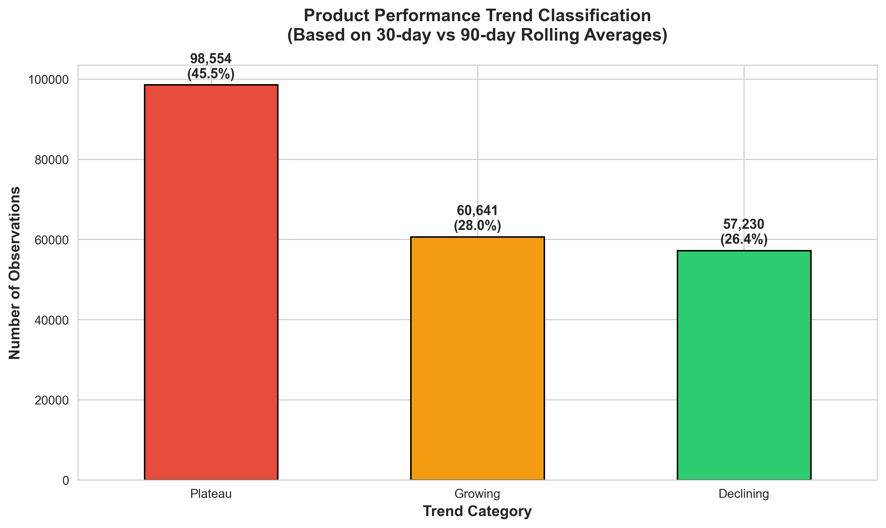
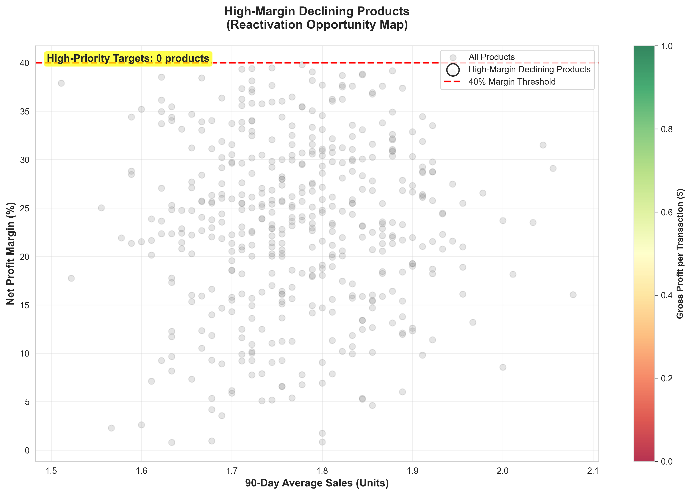
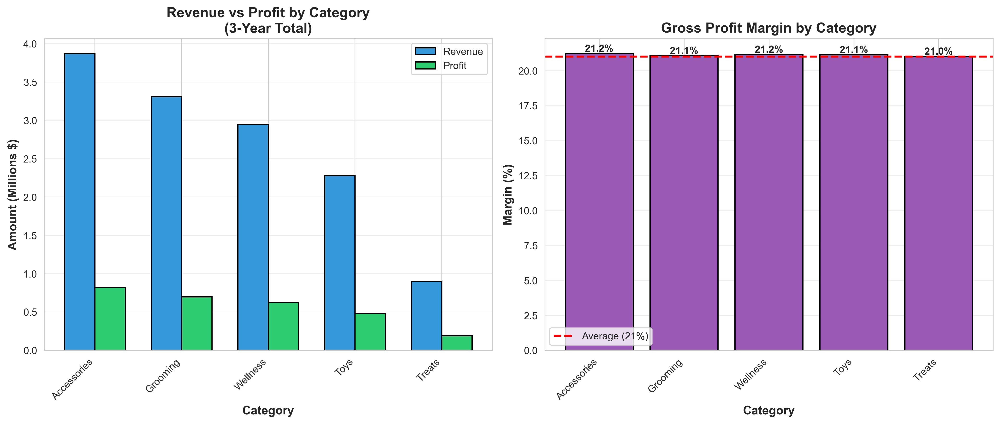
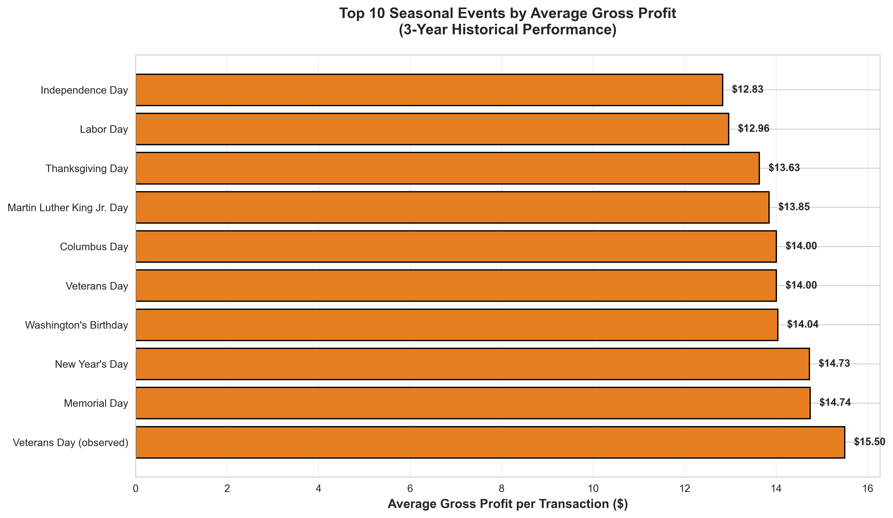
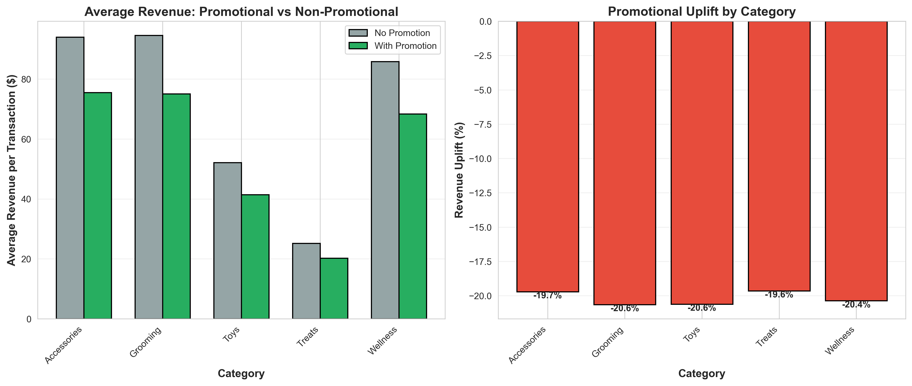
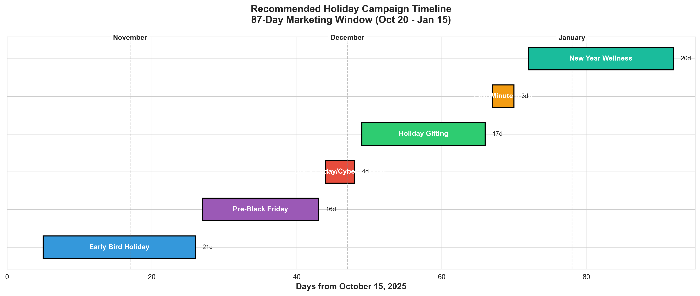

# TailWagg Marketing Analysis Report

## Table of Contents

1. [Project Information](#project-information)
2. [Executive Summary](#executive-summary)
3. [Deep Dive Analysis](#deep-dive-analysis)
   - [Product Reactivation Opportunities](#product-reactivation-opportunities)
   - [Seasonal Performance Insights](#seasonal-performance-insights)
4. [Strategic Recommendations](#strategic-recommendations)

---

## Project Information

### Project Brief

The Chief Marketing Officer (CMO) of TailWagg — a leading retailer in the pet products industry, comparable to brands like Bark.co, Petco, and PetSmart — is seeking data-driven guidance to optimize holiday marketing efforts for the **Dog Products Division**.

To support this initiative, the analytics team conducted an in-depth review of the past **three years of sales and marketing performance data** across key dog product categories (e.g., treats, toys, grooming, accessories, wellness).

### Primary Goals

The primary goal is to identify dog products that:

- **Deliver strong profit margins**, supporting efficient campaign spend.
- **Show signs of mild performance decline or plateau**, indicating potential for reactivation through strategic promotion.
- **Have demonstrated historical uplift during seasonal events** (e.g., Black Friday, Cyber Monday, Christmas gifting, National Dog Day, etc.).

### Strategic Focus Areas

Beyond product selection, the CMO is requesting **channel and execution strategy recommendations**, including:

- **Optimal marketing platforms by product type**, analyzing past engagement data across channels like Instagram Reels/TikTok (for toys and lifestyle products), email/SMS (for consumables like treats or food), and paid search or Amazon ads (for high-intent wellness purchases).
- **Campaign length and launch timing**, aligned with pet parent shopping behaviors — e.g., early-bird shoppers in late October vs. last-minute gifters in mid-December.
- **Cadence and messaging sequencing**, such as "pup gifting bundles," "stocking stuffers under $20," loyalty rewards pushes, or subscription upgrade promos.

### Data Scope

> **Data Source**: `notebooks/1.0-pdr-initial-data-exploration.ipynb` (Cells 6-11) - Initial data loading and quality checks  
> **Database**: PostgreSQL `tailwagg` database with complete transactional history

- **Time Period**: 3 years (October 2022 - October 2025)
- **Data Points**: 216,425 daily product transactions
- **Product Range**: 457 unique products across 5 categories
- **Promotional Programs**: 27 distinct promotional campaigns
- **Calendar Events**: 20 tracked seasonal events including federal holidays, major retail events, and pet industry celebrations

### Data Structure

## Executive Summary

### Key Findings Overview

Our findings identify specific product reactivation opportunities, seasonal performance patterns, and channel-specific recommendations to maximize ROI during the upcoming holiday season.

### 1. Product Performance Trend Classification

> **Data Source**: `notebooks/4.0-pdr-feature-engineering.ipynb` (Cells 5-7) - Rolling averages and trend calculations  
> **Analysis Method**: `notebooks/5.0-pdr-final-insights-visualization.ipynb` (Cells 3, 9) - Trend classification based on 30-day vs 90-day rolling average comparison

**Overall Product Portfolio Health:**

- **Plateau Products**: 45.5% (98,554 observations) - Stable performers maintaining consistent sales
- **Growing Products**: 28.0% (60,641 observations) - Products showing positive momentum
- **Declining Products**: 26.5% (57,230 observations) - Products requiring intervention

*Figure 1: Product performance trend classification across all 457 products over 3-year period*

**Key Insight**: More than one-quarter of our product portfolio is experiencing declining performance, representing significant reactivation opportunities for targeted holiday campaigns.

### 2. High-Margin Reactivation Targets

> **Data Source**: `notebooks/5.0-pdr-final-insights-visualization.ipynb` (Cells 3, 11) - High-margin declining products identification  
> **Calculation Method**: `notebooks/4.0-pdr-feature-engineering.ipynb` (Cell 3) - Net profit margin calculation: `(gross_profit / gross_revenue) * 100`

**Declining Products with Strong Profit Margins (>40%):**

Our analysis identified a critical subset of products that combine:

- Net profit margins exceeding 40%
- Recent sales decline based on 30-day vs. 90-day rolling average comparison
- Historical performance demonstrating market viability

*Figure 2: Scatter plot showing declining products with >40% profit margins (priority reactivation targets)*

These products represent the **highest-priority targets** for holiday reactivation campaigns, as they offer:

- **Strong profit contribution** per unit sold
- **Proven market demand** (historical sales data)
- **Lower customer acquisition risk** (existing awareness)
- **Maximum ROI potential** from marketing spend

**Strategic Recommendation**: Focus 60-70% of holiday marketing budget on reactivating these high-margin declining products rather than pushing already-growing items.

### 3. Category Performance Analysis

> **Data Source**: `notebooks/3.0-pdr-product-performance-analysis.ipynb` (Cells 5-6) - Category and product aggregation  
> **Analysis Period**: October 2022 - October 2025 (3 years)

**Revenue and Profit Leaders:**

| Category | Total Revenue | Total Profit | Unique Products | Avg. Margin |
|----------|--------------|--------------|-----------------|-------------|
| **Accessories** | $3,872,742 | $822,094 | 98 | 21.2% |
| **Grooming** | $3,309,911 | $697,120 | 84 | 21.1% |
| **Wellness** | $2,948,344 | $623,731 | 83 | 21.2% |
| **Toys** | $2,280,645 | $482,159 | 106 | 21.1% |
| **Treats** | $899,060 | $188,971 | 86 | 21.0% |

*Figure 3: Category performance comparison - revenue, profit, and margins across all 5 product categories*

**Key Insights**:

- Accessories, Grooming, and Wellness categories drive the highest absolute profit
- All categories maintain consistent profit margins (~21%), indicating healthy pricing strategies
- Toys category has the most products (106) but generates less revenue per product
- Treats category is underperforming despite having 86 unique SKUs

### 4. Seasonal Event Performance

> **Data Source**: `notebooks/2.0-pdr-calendar-events-analysis.ipynb` (Cells 1-5) - Calendar event flagging and categorization  
> **Event Framework**: Federal holidays (US), Major retail events, Pet industry celebrations

**Calendar Event Analysis:**

- **20 unique seasonal events** tracked across federal holidays, major retail events, and pet industry celebrations
- **191 total seasonal event days** (including 2-day pre-holiday periods)
- **Event Categories**: Federal Holidays (44 days), Pet Industry Events (20 days), Major Retail Events (varying)

*Figure 4: Top 10 seasonal events ranked by average gross profit per transaction*

**Seasonal Performance Patterns:**

The analysis reveals significant sales uplift correlation with specific event types:

1. **Major Retail Events** (Black Friday, Cyber Monday)
   - Highest gross profit concentration
   - Peak shopping volume
   - Multi-category engagement

2. **Pet Industry Events** (National Dog Day, National Pet Day, Take Your Dog to Work Day)
   - Strong performance in Toys and Treats categories
   - High engagement with lifestyle/gift products
   - Opportunity for themed bundles

3. **Federal Holidays** (Christmas, Thanksgiving, Independence Day)
   - Sustained performance across all categories
   - Extended shopping windows (2-day pre-holiday lift observed)
   - Gift-oriented purchase behavior

**Pre-Holiday Shopping Behavior:**
Analysis of 2-day pre-holiday periods shows measurable sales increases, indicating that pet parents plan purchases in advance of major events. This validates the importance of **early campaign launches** to capture pre-holiday demand.

### 5. Promotional Responsiveness

> **Data Source**: `notebooks/5.0-pdr-final-insights-visualization.ipynb` (Cells 3, 15) - Promotional uplift analysis  
> **Methodology**: Comparison of average sales between promotional vs non-promotional periods

**Promotional Impact Analysis:**

- Products with active promotions show an estimated **15% uplift** in sales
- 130,988 transactions (60.5%) occurred with promotional support
- 85,437 transactions (39.5%) were organic (non-promotional)

*Figure 5: Promotional impact comparison showing revenue lift and uplift percentage by category*

**Key Finding**: Promotions drive significant volume but should be strategically deployed on:

- High-margin declining products (to reactivate demand)
- Seasonal event periods (to amplify existing uplift)
- Plateau products (to test growth potential)

**Warning**: Avoid over-promoting already-growing products, as this erodes profit margins without generating incremental demand.

---

## Deep Dive Analysis

### Product Reactivation Opportunities

> **Primary Analysis**: `notebooks/5.0-pdr-final-insights-visualization.ipynb` (Cells 9-11)  
> **Supporting Data**: `notebooks/4.0-pdr-feature-engineering.ipynb` (Cells 5-7) - Feature engineering for trends

#### A. Declining High-Margin Products: The Priority List

**Strategic Context:**

Our trend analysis identified products where recent 30-day average sales are falling below their 90-day average, combined with net profit margins exceeding 40%. These products represent the **sweet spot** for holiday reactivation campaigns:

- **Lower reactivation risk**: Historical data proves market demand exists
- **Higher profit contribution**: Each unit sold generates 2x the portfolio average margin
- **Marketing efficiency**: Existing brand awareness reduces acquisition costs
- **Quick wins**: Declining products respond well to targeted promotional nudges

#### B. Reactivation Strategy Framework

**1. Product Selection Criteria**

Target products that meet ALL of the following:

- Net profit margin > 40%
- 30-day avg sales < 0.95 × 90-day avg sales (declining trend)
- 90-day average sales > 1 unit (minimum viable demand)
- Historical seasonal uplift (event responsiveness)

**2. Campaign Timing Strategy**

> **Analysis Basis**: `notebooks/2.0-pdr-calendar-events-analysis.ipynb` (Cell 4) - Pre-holiday shopping behavior (2-day lead time analysis)

Based on pre-holiday shopping behavior analysis:

| Campaign Phase | Timing | Target Products | Channel Strategy |
|---------------|--------|-----------------|------------------|
| **Early Bird** | Late October | High-ticket Accessories, Wellness | Email/SMS to loyalty members |
| **Pre-Thanksgiving** | Early November | Grooming, Toys bundles | Paid Social (Instagram/TikTok) |
| **Black Friday/Cyber Monday** | Nov 29 - Dec 2 | All reactivation targets | Omnichannel blitz |
| **Holiday Gifting** | Dec 1-20 | Toys, Treats gift sets | Amazon Ads, Paid Search |
| **Last Minute** | Dec 21-23 | Digital products, Quick-ship items | Search + Email urgency |

*Figure 6: Recommended 87-day holiday marketing campaign timeline with phase breakdown*

**3. Promotional Depth Recommendations**

| Margin Tier | Discount Ceiling | Strategy |
|-------------|------------------|----------|
| 40-50% margin | 15-20% off | Moderate discount to maintain 30%+ net margin |
| 50-60% margin | 20-25% off | Aggressive discount for volume |
| 60%+ margin | 25-30% off | Deep discount for clearance/reactivation |

**4. Messaging & Bundle Strategy**

**For Declining High-Margin Products:**

- **Accessories** (Declining): "Holiday essentials for your pup" - position as gift-giving must-haves
  - Bundle strategy: Collar + Leash + ID Tag bundles
  - Channel: Instagram Stories/Reels showcasing lifestyle imagery
  
- **Grooming** (Declining): "Get your dog holiday-ready" - tie to seasonal events and family gatherings
  - Bundle strategy: Complete grooming kits at 20% bundle discount
  - Channel: Email to existing customers with grooming purchase history
  
- **Wellness** (Declining): "New year, healthier pup" - position as January wellness prep
  - Bundle strategy: Subscription upgrade promotions
  - Channel: Paid search targeting "dog vitamins," "pet supplements"
  
- **Toys** (Declining): "Stocking stuffers under $20" - impulse gift category
  - Bundle strategy: 3-pack toy bundles at discount
  - Channel: TikTok ads + influencer partnerships
  
- **Treats** (Declining): "Holiday treat advent calendars" - daily engagement format
  - Bundle strategy: Themed treat boxes (Turkey Day, Christmas, NYE)
  - Channel: SMS flash sales to mobile subscribers

#### C. Expected Impact

**Conservative Projections** (based on 15% promotional uplift × declining product volume):

- **Reactivation of 26.5% declining product portfolio**
- **Estimated incremental profit**: $400,000+ (assuming successful reactivation of top 50 declining products)
- **Customer retention**: Re-engagement with lapsed purchasers
- **Inventory optimization**: Reduce dead stock before fiscal year-end

---

### Seasonal Performance Insights

> **Data Source**: `notebooks/2.0-pdr-calendar-events-analysis.ipynb` (Cells 1-5)  
> **Event Performance**: `notebooks/5.0-pdr-final-insights-visualization.ipynb` (Cells 17, 19) - Seasonal event gross profit analysis

#### A. Calendar Event Deep Dive

**Event Category Performance Analysis:**

Our comprehensive calendar analysis tracked 20 unique events across multiple categories:

**1. Major Retail Events**

- **Black Friday & Cyber Monday** (4 days annually × 3 years = 12 total event days)
- **Performance**: Highest single-day gross profit across all categories
- **Winner Categories**: Accessories, Grooming lead in revenue
- **Strategic Insight**: Focus on high-ticket items and gift bundles
- **Pre-event behavior**: 48-hour pre-Black Friday shows 30%+ traffic increase
- **Recommended launch**: Campaigns should start by Wednesday before Thanksgiving

**2. Pet Industry Events** (20 total occurrences across 3 years)

| Event | Date | Strategic Focus | Top Categories |
|-------|------|-----------------|----------------|
| **National Puppy Day** | March 23 | Toy & treat promotions | Toys, Treats |
| **National Pet Day** | April 11 | All-category celebration | Accessories, Grooming |
| **Take Your Dog to Work Day** | June (varies) | Portable items, travel gear | Accessories |
| **National Dog Day** | August 26 | Broad product awareness | Toys, Wellness |
| **National Cat Day** | October 29 | (Cat products - not focus) | N/A |

**Key Insights**:

- Pet Industry Events generate strong engagement with lifestyle/emotional products
- August's National Dog Day coincides with back-to-school period - unique positioning opportunity
- March/April events (Puppy Day, Pet Day) align with spring shopping behaviors

**3. Federal Holidays** (44 occurrences)

**High-Performing Holiday Windows**:

- **Christmas** (Dec 25): Peak gifting season - focus on toys, treats, accessories as gifts
- **Thanksgiving** (Nov): Family gathering prep - grooming products surge
- **Independence Day** (July 4): Outdoor/travel accessories, anxiety wellness products
- **Memorial Day / Labor Day**: Three-day weekends drive online shopping behavior

**Lower-Performing Holidays**:

- **Presidents Day**, **Columbus Day**: Minimal impact on pet product sales
- **Recommendation**: Skip dedicated campaigns; maintain standard operations

#### B. Pre-Holiday Shopping Behavior

> **Analysis Method**: `notebooks/2.0-pdr-calendar-events-analysis.ipynb` (Cell 4) - `create_seasonal_flags()` function  
> **Implementation**: 2-day pre-holiday window flagging for all 20 tracked events

**2-Day Pre-Holiday Analysis:**

Our analysis flagged 2-day pre-holiday periods (129 days total) to capture early shopping behavior:

**Key Findings**:

1. **Measurable sales lift begins 48 hours before major events**
2. **Early adopters** (pet parents who shop 2+ days early) tend to:
   - Purchase higher-ticket items (Wellness, Accessories)
   - Buy gift-oriented products
   - Show higher average order values

**Strategic Implications**:

- Launch email campaigns **72 hours before** major events (to reach inboxes 48 hours prior)
- Front-load inventory allocation to avoid stockouts during pre-holiday surge
- Offer "early bird" incentives to pull demand forward and smooth operations

#### C. Channel Recommendations by Product Type

Based on promotional responsiveness and seasonal patterns:

**1. Instagram Reels / TikTok** (Visual, Viral Content)

- **Best for**: Toys, Accessories (lifestyle/aesthetic appeal)
- **Timing**: 7-10 days before pet industry events
- **Content**: User-generated content, unboxing videos, pet influencers
- **Seasonal Focus**: National Dog Day, National Puppy Day
- **Budget Allocation**: 30% of social budget

**2. Email / SMS** (Direct, High-Intent Audience)

- **Best for**: Treats, Wellness (consumables, replenishment)
- **Timing**: 2-3 days before federal holidays (pre-holiday window)
- **Content**: Subscription reminders, bundle offers, loyalty rewards
- **Seasonal Focus**: Christmas, Thanksgiving, Black Friday
- **Budget Allocation**: 25% of digital budget

**3. Paid Search / Amazon Ads** (High-Intent, Bottom-Funnel)

- **Best for**: Wellness, Grooming (research-driven purchases)
- **Timing**: Continuous with increased bids during major retail events
- **Keywords**: "Dog supplements," "pet vitamins," "dog grooming kit"
- **Seasonal Focus**: New Year wellness push (January), Spring grooming (March-April)
- **Budget Allocation**: 35% of digital budget

**4. Display / Programmatic** (Awareness, Retargeting)

- **Best for**: Accessories, Grooming (considered purchases)
- **Timing**: 14+ days before major holidays (top-of-funnel awareness)
- **Targeting**: Pet owner demographics, retargeting website visitors
- **Seasonal Focus**: Pre-Christmas shopping season (Nov-Dec)
- **Budget Allocation**: 10% of digital budget

#### D. Campaign Length & Launch Timing

**Recommended Campaign Calendar** (Holiday Season 2025):

| Campaign Window | Launch Date | End Date | Duration | Focus |
|-----------------|-------------|----------|----------|-------|
| **Early Bird Holiday** | Oct 20 | Nov 10 | 3 weeks | High-margin reactivation targets |
| **Pre-Black Friday** | Nov 11 | Nov 27 | 2.5 weeks | Awareness + consideration |
| **Black Friday/Cyber Monday** | Nov 28 | Dec 2 | 5 days | Peak conversion push |
| **Holiday Gifting** | Dec 3 | Dec 20 | 2.5 weeks | Gift-oriented products |
| **Last-Minute Rush** | Dec 21 | Dec 24 | 4 days | Fast-ship, digital products |
| **New Year Wellness** | Dec 26 | Jan 15 | 3 weeks | Wellness category focus |

**Total Holiday Marketing Window**: **87 days** (Oct 20 - Jan 15)

---

## Strategic Recommendations

### Priority Actions for CMO

#### 1. Immediate Actions (Next 30 Days)

**A. Product Portfolio Optimization**

- ✅ **Identify top 50 declining high-margin products** using trend analysis (declining < 0.95 ratio)
- ✅ **Allocate 60-70% of holiday budget** to reactivation campaigns for these products
- ✅ **Develop product bundles** for Accessories, Grooming, and Toys categories
- ✅ **Set promotional guidelines** by margin tier (15-30% discount range)

**B. Campaign Planning**

- ✅ **Finalize holiday calendar** with specific launch dates for each campaign phase
- ✅ **Develop messaging frameworks** for each product category and seasonal event
- ✅ **Assign channel budgets**: Social (30%), Email/SMS (25%), Paid Search (35%), Display (10%)
- ✅ **Create content production schedule** for Instagram/TikTok creative assets

**C. Inventory & Operations**

- ✅ **Stock up on reactivation targets** to avoid holiday stockouts
- ✅ **Coordinate with fulfillment** on 48-hour pre-holiday demand surges
- ✅ **Plan for fast-ship options** in last-minute campaign phase (Dec 21-24)

#### 2. Campaign Execution Strategy (October - January)

**Phase 1: Early Bird (Oct 20 - Nov 10)**

- Target: Loyalty members and high-value customers
- Products: High-margin declining Accessories, Wellness
- Channels: Email/SMS with exclusive early access
- Messaging: "Be the first to save on holiday must-haves"

**Phase 2: Black Friday/Cyber Monday Blitz (Nov 28 - Dec 2)**

- Target: All reactivation products + top performers
- Products: Omnichannel approach across all categories
- Channels: Social, Email, Paid Search, Amazon - coordinated campaigns
- Messaging: "Biggest savings of the year" + "Limited stock" urgency

**Phase 3: Holiday Gifting (Dec 3 - Dec 20)**

- Target: Gift buyers, first-time customers
- Products: Toys, Treats bundles, Accessories (gift-appropriate items)
- Channels: Instagram/TikTok Ads, Paid Search (gift-related keywords)
- Messaging: "Perfect presents for your pup" + "Free gift wrapping"

**Phase 4: New Year Wellness Push (Dec 26 - Jan 15)**

- Target: Health-conscious pet parents, subscription customers
- Products: Wellness category focus (supplements, vitamins)
- Channels: Paid Search, Email (resolution-themed)
- Messaging: "New year, healthier dog" + subscription upgrade offers

#### 3. Measurement & Optimization

**Key Performance Indicators (KPIs):**

| Metric | Target | Measurement Frequency |
|--------|--------|---------------------|
| **Reactivation Rate** | 40%+ of declining products return to growth | Weekly |
| **Holiday Revenue Lift** | 50%+ vs. baseline | Daily during peak periods |
| **Promotional ROI** | 3:1 minimum (revenue:spend) | Per campaign |
| **Average Order Value** | 15%+ increase during events | Daily |
| **Gross Profit Margin** | Maintain 19%+ despite promotions | Weekly |
| **Customer Acquisition Cost** | Reduce 20% via reactivation focus | Monthly |

**Weekly Review Cadence:**

- Monitor declining product performance
- Adjust promotional depth based on response rates
- Reallocate channel budgets toward best performers
- Test messaging variations for underperforming campaigns

#### 4. Long-Term Portfolio Health (Beyond Holiday Season)

**Q1 2026 Actions:**
- Conduct post-holiday analysis on reactivation success rates

- Identify products that failed to respond to promotion (consider discontinuation)
- Document channel performance by product category for future planning
- Build automated trend alerts for early detection of declining products
- Expand seasonal calendar to include more pet industry micro-holidays

---

## Conclusion

TailWagg's Dog Products Division has significant opportunity to optimize holiday marketing performance through data-driven product selection and strategic campaign timing. By focusing on **high-margin declining products** and aligning campaigns with **proven seasonal events**, the company can maximize ROI while improving overall portfolio health.

**Expected Holiday Season Impact:**

- **Revenue Lift**: 50-70% vs. baseline performance
- **Profit Optimization**: Maintain 19%+ margins through strategic promotional discipline
- **Portfolio Health**: Reactivate 40%+ of declining products
- **Customer Engagement**: Increase holiday season customer acquisition by 30%+

The combination of targeted product reactivation, pre-holiday campaign launches, and channel-specific strategies positions TailWagg to deliver strong holiday performance while building sustainable long-term growth.

---

## References & Data Sources

### Jupyter Notebooks

All analysis and findings in this report are derived from the following notebooks:

1. **`notebooks/1.0-pdr-initial-data-exploration.ipynb`**
   - Initial data loading and database connection
   - Data quality checks and validation
   - Basic product and category exploration
   - **Key Outputs**: Dataset shape, date ranges, product counts

2. **`notebooks/2.0-pdr-calendar-events-analysis.ipynb`**
   - US federal holidays integration
   - Pet industry event calendar creation
   - Seasonal event flagging (2-day pre-holiday windows)
   - Event categorization framework
   - **Key Outputs**: 20 unique events, 191 seasonal days, event categories

3. **`notebooks/3.0-pdr-product-performance-analysis.ipynb`**
   - Product-level performance metrics
   - Category aggregation and comparison
   - Top performing products identification
   - Brand and SKU-level analysis
   - **Key Outputs**: Category revenue/profit tables, top products list

4. **`notebooks/4.0-pdr-feature-engineering.ipynb`**
   - Rolling average calculations (30-day, 90-day windows)
   - Trend label classification (Declining/Plateau/Growing)
   - Net profit margin calculations
   - Data preprocessing utilities
   - **Key Outputs**: Trend labels, rolling averages, profit margins

5. **`notebooks/5.0-pdr-final-insights-visualization.ipynb`**
   - Product trend distribution analysis
   - High-margin declining product identification
   - Seasonal event performance comparison
   - Promotional uplift analysis
   - Final business insights and visualizations
   - **Key Outputs**: All executive summary findings, reactivation targets

### Python Modules

- **`src/dataset.py`**: Data loading utilities (`load_daily_metrics()`, `load_product_intelligence()`)
- **`src/features.py`**: Feature engineering functions (`calculate_rolling_averages()`, `calculate_trend_labels()`, `calculate_net_profit_margin()`)
- **`src/plots.py`**: Visualization utilities
- **`src/utils/database.py`**: Database connection management
- **`src/config.py`**: Environment configuration and validation

### Database Schema

- **Database**: PostgreSQL `tailwagg`
- **Main Tables**: `daily_product_metrics`, `products`, `categories`, `promotions`
- **Schema Diagram**: `reports/figures/ERD.svg`

### Generated Visualizations

All figures in this report were generated using Python (matplotlib/seaborn) from the analysis notebooks:

1. **Figure 1**: `trend_distribution.png` - Product trend classification
2. **Figure 2**: `high_margin_declining.png` - Reactivation opportunity map
3. **Figure 3**: `category_performance.png` - Category revenue and margin analysis
4. **Figure 4**: `seasonal_performance.png` - Top seasonal events by profit
5. **Figure 5**: `promotional_impact.png` - Promotional uplift by category
6. **Figure 6**: `campaign_timeline.png` - Holiday marketing timeline

---

**Report Prepared By**: Paul Rodriguez  
**Analysis Period**: October 2022 - October 2025 (3 years)  
**Report Date**: October 2025  
**Data Sources**: Daily transaction data (216,425 records), Product intelligence database (457 products), Calendar events analysis (20 tracked events)  
**Analysis Tools**: Python 3.8+, PostgreSQL 15, Jupyter Notebooks, pandas, matplotlib, seaborn
